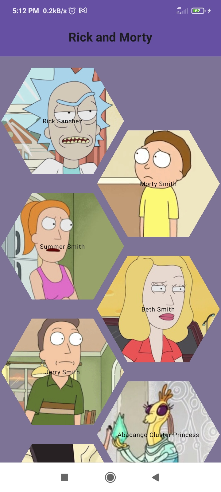

# Rick And Morty GraphQL JetpackCompose
       

Android App, Jetpack Compose, Apollo GraphQL, Rick and Morty API, Clean Code, Custom Shape for lazy colums items

## Installation

1. Clone this repository.
2. Open the project in Android Studio.
3. Run the application on a device or emulator.
